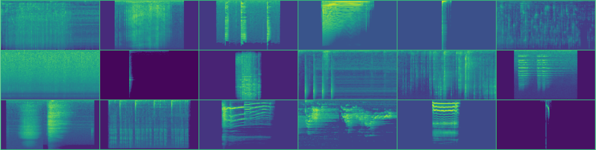
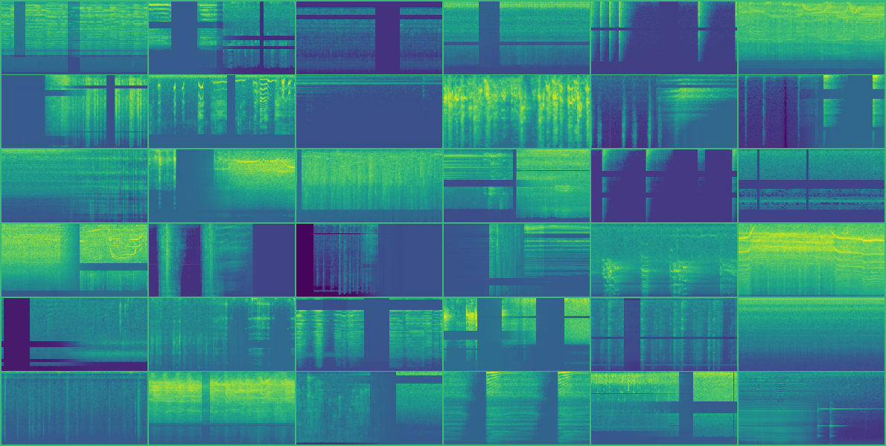

# Argus solution Freesound Audio Tagging 2019



Source code of 6th place solution [public LB] for [Freesound Audio Tagging 2019](https://www.kaggle.com/c/freesound-audio-tagging-2019). Target of competition is develop an algorithm to tag audio data automatically using a diverse vocabulary of 80 categories.

## Solution 

Key points:
* Log-scaled mel-spectrograms
* CNN model with attention and skip connections
* SpecAugment, Mixup augmentations 
* Hand relabeling curated dataset samples with low score
* Ensemble with MLP second-level model and geometric mean blending

### Data preprocessing

Log-scaled mel-spectrograms is the current standard for use with CNN for audio scene classification. [Converting audio to spectrograms](src/audio.py) in this solution inspired from [daisukelab's data preprocessing notebooks](https://www.kaggle.com/daisukelab/creating-fat2019-preprocessed-data). Audio config parameters: 
```
sampling_rate = 44100
hop_length = 345 * 2
fmin = 20
fmax = sampling_rate // 2
n_mels = 128
n_fft = n_mels * 20
min_seconds = 0.5
```

### Augmentations 
Several augmentations was applied on spectrograms while training. Part of code from [transforms.py](src/transforms.py) with comments: 

```
size = 256
transforms = Compose([
    OneOf([
        PadToSize(size, mode='wrap'),      # Reapeat small clips
        PadToSize(size, mode='constant'),  # Pad with a minimum value
    ], p=[0.5, 0.5]),
    RandomCrop(size),                      # Crop 256 values on time axis 
    UseWithProb(
        # Random resize crop helps a lot, but I can't explain why ¯\_(ツ)_/¯   
        RandomResizedCrop(scale=(0.8, 1.0), ratio=(1.7, 2.3)),
        prob=0.33
    ),
    # Masking blocks of frequency channels, and masking blocks of time steps
    UseWithProb(SpecAugment(num_mask=2,       
                            freq_masking=0.15,
                            time_masking=0.20), 0.5),
    # Use librosa.feature.delta with order 1 and 2 for creating 2 additional channels 
    # then divide by 100

    ImageToTensor()                        
])
```

MixUp augmentation was very useful in competition. This method creates a training example based on the weighted average of the two samples.  
In addition to the default MixUp method has been applied `SigmoidConcatMixer`: 


Some augmented spectrograms, looks crazy :)  


### Model 

### Training 

### Ensemble 

### Lab journal 

The progress of the solution during the competition can be viewed in the [laboratory journal](https://docs.google.com/spreadsheets/d/1uOp2Du3CROtpg7TuSFmSejyXQe2Dp8DGh5Dm5onBWfc/edit?usp=sharing). It describes all the experiments and ideas partially in Russian, sorry.

## Quick setup and start 

### Requirements 

*  Nvidia drivers, CUDA >= 10.0, cuDNN >= 7
*  [Docker](https://www.docker.com), [nvidia-docker](https://github.com/NVIDIA/nvidia-docker) 

The provided dockerfile is supplied to build image with CUDA support and cuDNN.


### Preparations 

* Clone the repo, build docker image. 
    ```bash
    git clone https://github.com/lRomul/argus-freesound.git
    cd argus-freesound
    make build
    ```

* Download and extract [dataset](https://www.kaggle.com/c/freesound-audio-tagging-2019/data) to `data` folder

    Folder structure should be:
    ```
    data
    ├── README.md
    ├── sample_submission.csv
    ├── test
    ├── train_curated
    ├── train_curated.csv
    ├── train_noisy
    └── train_noisy.csv
    ```

### Run

* Run docker container 
    ```bash
    make run
    ```

* Create file with folds split
    ```bash
    python make_folds.py
    ```
 
#### Single model

For example take experiment `corr_noisy_007`:
 
* Train single 5 fold model
    
    ```bash
    python train_folds.py --experiment corr_noisy_007
    ```
    
    Model weights will be in `data/experiments/corr_noisy_007`
    
* Predict train and test, evaluate metrics 

    ```bash
    python predict_folds.py --experiment corr_noisy_007
    ```
   
   Predictions, submission file and validation metrics will be in `data/predictions/corr_noisy_007`
