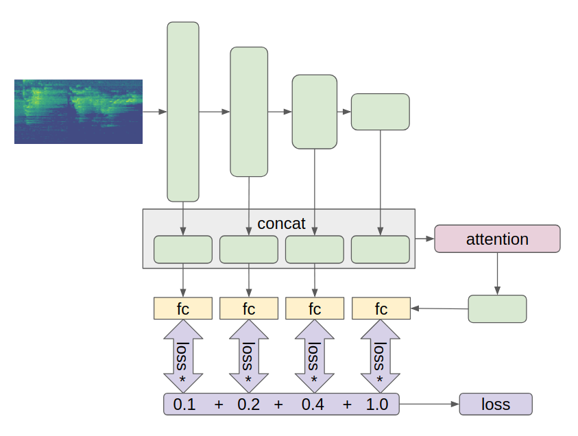

# Argus solution Freesound Audio Tagging 2019


The source code of 6th place solution [public LB] for [Freesound Audio Tagging 2019](https://www.kaggle.com/c/freesound-audio-tagging-2019). The target of competition is to develop an algorithm to tag audio data automatically using a diverse vocabulary of 80 categories. The main research question addressed in this competition is how to adequately exploit a small amount of reliable, manually-labeled data, and a larger quantity of noisy web audio data in a multi-label audio tagging task with a large vocabulary setting.

## Solution 

Key points:
* Log-scaled mel-spectrograms
* CNN model with attention, skip connections and auxiliary classifiers
* SpecAugment, Mixup augmentations 
* Hand relabeling curated dataset samples with a low score
* Ensemble with MLP second-level model and geometric mean blending

The [Argus](https://github.com/lRomul/argus) framework for PyTorch was used, which makes the learning process simpler and more compact.

### Data preprocessing

Log-scaled mel-spectrograms is the current standard for use with CNN for audio scene classification. [Converting audio to spectrograms](src/audio.py) in this solution inspired from [daisukelab's data preprocessing notebook](https://www.kaggle.com/daisukelab/creating-fat2019-preprocessed-data). Audio config parameters: 
```
sampling_rate = 44100
hop_length = 345 * 2
fmin = 20
fmax = sampling_rate // 2
n_mels = 128
n_fft = n_mels * 20
min_seconds = 0.5
```

### Augmentations 
Several augmentations was applied on spectrograms while training. Part of code from [transforms.py](src/transforms.py) with comments: 

```
size = 256
transforms = Compose([
    OneOf([
        PadToSize(size, mode='wrap'),      # Reapeat small clips
        PadToSize(size, mode='constant'),  # Pad with a minimum value
    ], p=[0.5, 0.5]),
    RandomCrop(size),                      # Crop 256 values on time axis 
    UseWithProb(
        # Random resize crop helps a lot, but I can't explain why ¯\_(ツ)_/¯   
        RandomResizedCrop(scale=(0.8, 1.0), ratio=(1.7, 2.3)),
        prob=0.33
    ),
    # SpecAugment [1], masking blocks of frequency channels, and masking blocks of time steps
    UseWithProb(SpecAugment(num_mask=2,       
                            freq_masking=0.15,
                            time_masking=0.20), 0.5),
    # Use librosa.feature.delta with order 1 and 2 for creating 2 additional channels 
    # then divide by 100 
    ImageToTensor()                  
])
```

MixUp [2] augmentation was very useful in competition. This method creates a training example based on the weighted average of the two samples.  
In addition to the default MixUp method has been applied [SigmoidConcatMixer](src/mixers.py). it works like a smooth gradient transition from one clip to another over time.

Some augmented spectrograms, it's looks crazy :)  


### Model 

Model from [mhiro2's kernel](https://www.kaggle.com/mhiro2/simple-2d-cnn-classifier-with-pytorch) was used as a starting point. After numerous experiments, the [architecture](src/models/aux_skip_attention.py) with attention, skip connections and auxiliary classifiers was designed.



### Training 

* 5 random folds 
* Loss: BCE on curated, Lsoft [3] with beta 0.7 on noisy data  
* Optimizer: Adam with initial LR 0.0009  
* LR scheduler: Reduce on a plateau with patience 6, factor 0.6  
* Use different probabilities for sampling curated and noisy data  
* Training on hand relabeled curated samples with a low lwlrap score by previous models  
* Training with BCE on noisy samples with a high lwlrap score by previous models
* Mixed precision training with `apex.amp` allows use batch size 128 with input size 256x128  


### Ensemble 

In final submission were used the geometric mean of 7 first-level models and 3 second-level models. As second-level models were used [MLP](src/stacking/models.py) trained with different hyperparameters. Seven first-level models were chosen by enumeration of combinations of trained experiments to finding highest CV score. 

### Lab journal 

The progress of the solution during the competition can be viewed in the [laboratory journal](https://docs.google.com/spreadsheets/d/1uOp2Du3CROtpg7TuSFmSejyXQe2Dp8DGh5Dm5onBWfc/edit?usp=sharing). It describes all the experiments and ideas partially in Russian, sorry.

## Quick setup and start 

### Requirements 

*  Nvidia drivers, CUDA >= 10.0, cuDNN >= 7
*  [Docker](https://www.docker.com), [nvidia-docker](https://github.com/NVIDIA/nvidia-docker) 

The provided dockerfile is supplied to build an image with CUDA support and cuDNN.


### Preparations 

* Clone the repo, build docker image. 
    ```bash
    git clone https://github.com/lRomul/argus-freesound.git
    cd argus-freesound
    make build
    ```

* Download and extract [dataset](https://www.kaggle.com/c/freesound-audio-tagging-2019/data) to `data` folder

    Folder structure should be:
    ```
    data
    ├── README.md
    ├── sample_submission.csv
    ├── test
    ├── train_curated
    ├── train_curated.csv
    ├── train_noisy
    └── train_noisy.csv
    ```

### Run

* Run docker container 
    ```bash
    make run
    ```

* Create a file with folds split
    ```bash
    python make_folds.py
    ```
 
#### Single model

For example take experiment `corr_noisy_007`, which is now in the [train_folds.py](train_folds.py):
 
* Train single 5 fold model
    
    ```bash
    python train_folds.py --experiment corr_noisy_007
    ```
    
    Model weights will be in `data/experiments/corr_noisy_007`
    
* Predict train and test, evaluate metrics 

    ```bash
    python predict_folds.py --experiment corr_noisy_007
    ```
   
   Predictions, submission file and validation metrics will be in `data/predictions/corr_noisy_007`


#### Ensemble

If you want to reproduce the whole ensemble, you should train all experiments in [stacking_predict.py](stacking_predict.py), a laboratory journal can help with experiments commit hashes. In the future, I will probably make this pipeline more simply reproducible.  


### Kernel build system 

It was quite impossible to manage the project without a way to split the solution into modules. The idea of kernel building from the [first place solution of the Mercari Price Suggestion Challenge](https://www.kaggle.com/c/mercari-price-suggestion-challenge/discussion/50256#latest-315679) was used. You can find the build system template [here](https://github.com/lopuhin/kaggle-script-template). 
To create a submission, run `python build_kernel.py`, this would compress the whole project into scripts in `kernel` folder:
* `kernel_template.py` - single model submission  
* `stacking_kernel_template.py` - ensemble submission


## References

[1] Daniel S. Park, William Chan, Yu Zhang, Chung-Cheng Chiu, Barret Zoph, Ekin D. Cubuk, Quoc V. Le, &quot;_SpecAugment: A Simple Data Augmentation Method for Automatic Speech Recognition_&quot;, [arXiv:1904.08779](https://arxiv.org/abs/1904.08779), 2019.

[2] Hongyi Zhang, Moustapha Cisse, Yann N. Dauphin, and David Lopez-Paz, &quot;_mixup: Beyondempirical risk minimization_&quot;, [arXiv:1710.09412](https://arxiv.org/abs/1710.09412), 2017.

[3] Eduardo Fonseca, Manoj Plakal, Daniel P. W. Ellis, Frederic Font, Xavier Favory, Xavier Serra, &quot;_Learning Sound Event Classifiers from Web Audio with Noisy Labels_&quot;, [arXiv:1901.01189](https://arxiv.org/abs/1901.01189), 2019.
